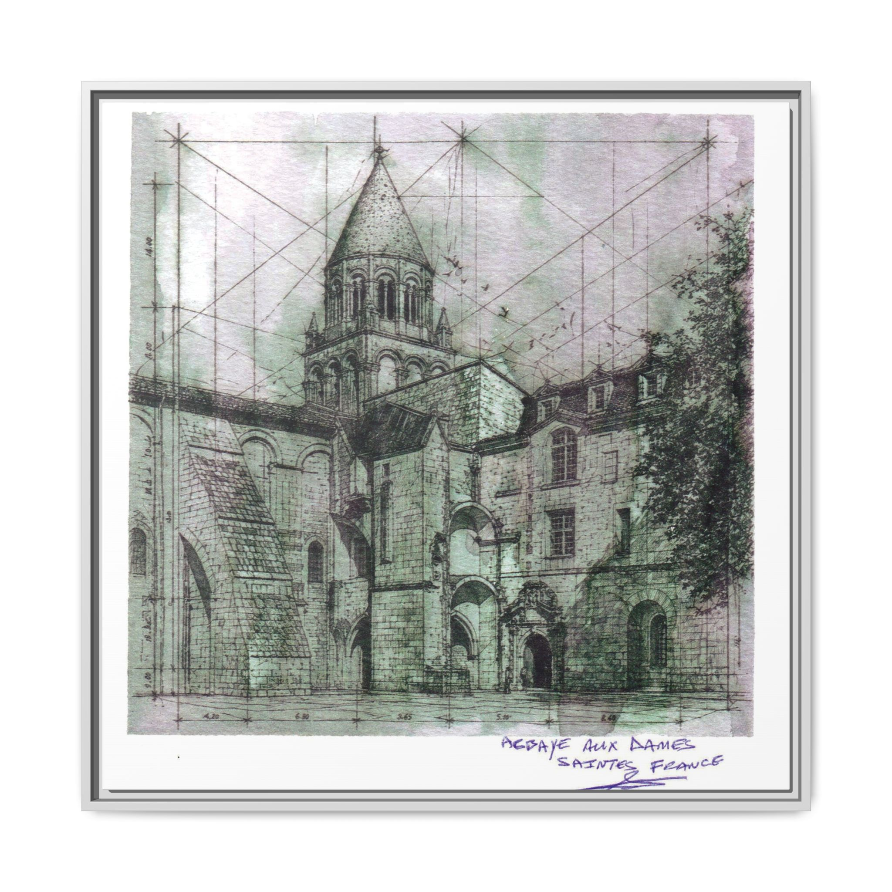

# Architectural Sketches  
### Studies of Form, Structure, and Spatial Poetry

The architectural drawings of **Gerald Allen Knowles** are rooted in decades of practice, teaching, and exploration.  
These works capture the quiet geometry of staircases, cloisters, façades, and historic structures — each piece a dialogue between precision and emotion.

---

## ✦ Featured Works  
### **Abbaye aux Dames — Architectural Perspective Study**  
A detailed architectural perspective sketch of the historic Abbaye aux Dames in Saintes, France.  
Hand‑drawn with structural precision and expressive linework.

### **Abbaye aux Dames — Perspective Study**  
A hand‑drawn exploration of rhythm, shadow, and ascending movement.  
framed-matte-canvas-print-vintage-abbaye-aux-dames-saintes-france-church-sketch-art.jpg

---

### **Tourtte Staircase — Saintes, France**  
A study in curvature, proportion, and architectural memory.  

---

### **Historic Façade Sketches**  
Linework capturing the character and aging beauty of European architecture.  

---

## ✦ About This Collection

These sketches reflect a lifetime of architectural observation — from France to Spain, the Bahamas to the Canary Islands.  
Each drawing is a moment of stillness, a meditation on structure, light, and the stories buildings carry.

---

## ✦ Shop the Prints

High‑quality prints of selected architectural works are available through the GAK Creations store.

[Visit the Print Store](https://www.gakcreations.com)

---

© 2026 GAK Creations — Art & Architecture
